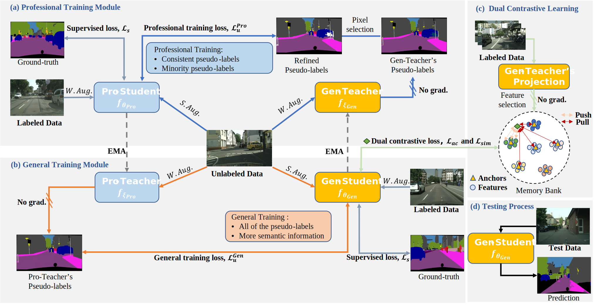
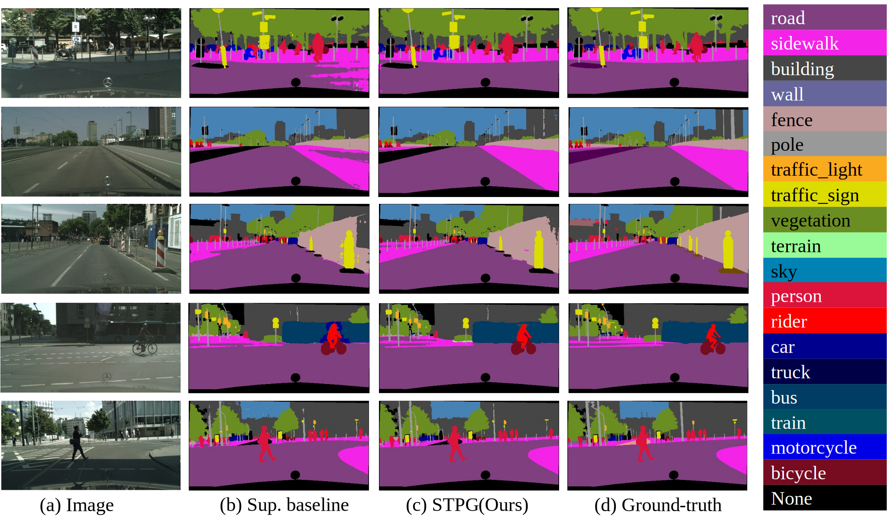
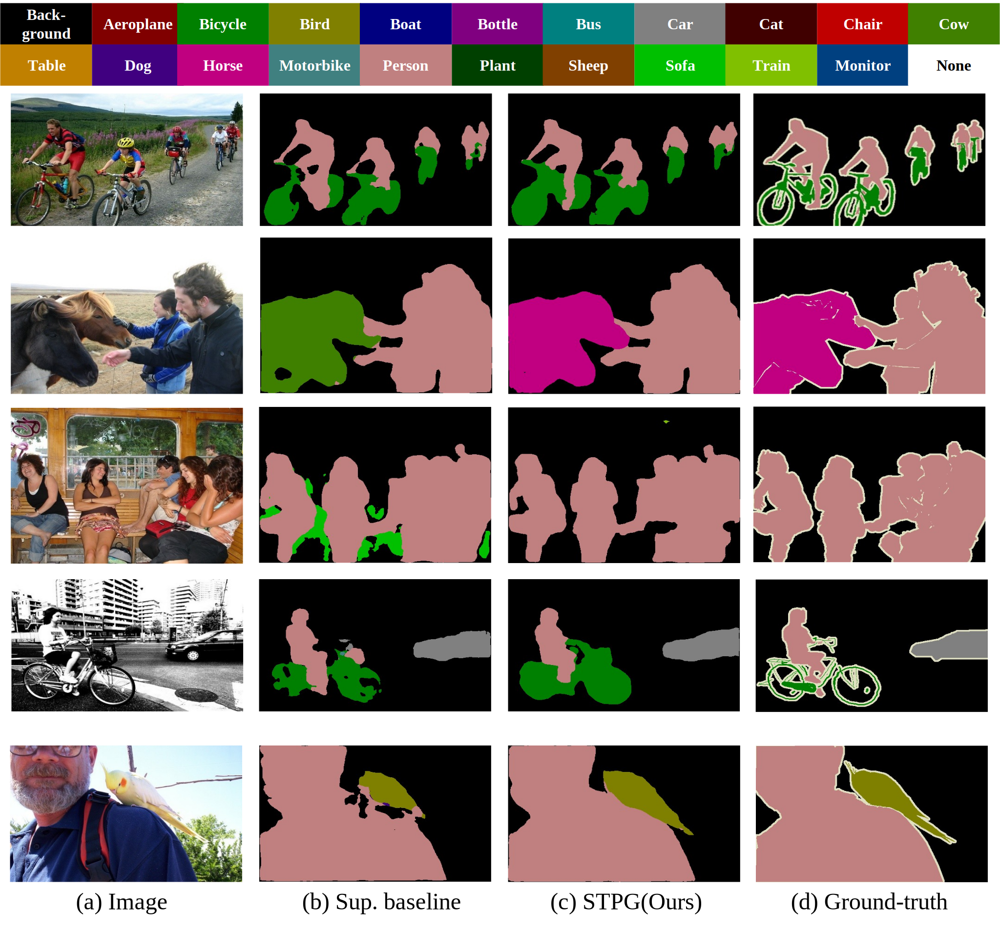

# Exploiting Minority Pseudo-Labels for Semi-Supervised Semantic Segmentation in Autonomous Driving



> For technical details, please refer to:
>
> [Exploiting Minority Pseudo-Labels for Semi-Supervised Semantic Segmentation in Autonomous Driving](https://arxiv.org/pdf/2409.12680)

## (0) Abstract

With the advancement of autonomous driving, semantic segmentation has achieved remarkable progress. The training of such networks heavily relies on image annotations, which are very expensive to obtain. Semi-supervised learning can utilize both labeled data and unlabeled data with the help of pseudo-labels. However, in many real-world scenarios where classes are imbalanced, majority classes often play a dominant role during training and the learning quality of minority classes can be undermined. To overcome this limitation, we propose a synergistic training framework, including a professional training module to enhance minority class learning and a general training module to learn more comprehensive semantic information. Based on a pixel selection strategy, they can iteratively learn from each other to reduce error accumulation and coupling. In addition, a dual contrastive learning with anchors is proposed to guarantee more distinct decision boundaries. In experiments, our framework demonstrates superior performance compared to state-of-the-art methods on benchmark datasets.


## (1) Setup

This code has been tested with Python 3.6, PyTorch 1.0.0 on Ubuntu 18.04.

* Setup the environment
  ```bash
  conda create -n STPG python=3.6
  source activate STPG
  conda install pytorch==1.0.0 torchvision==0.2.2
  ```

* Clone the repository

* Install the requirements
  ```bash
  pip install -r requirements.txt
  ```
  
* Download pertained models

  * Download the ResNet-50/ResNet-101 for training and move it to ./DATA/pytorch-weight/

      | Model                    | Baidu Cloud  |
      |--------------------------|--------------|
      | ResNet-50                | [Download](https://pan.baidu.com/s/1agsf6BSvmVVGTvk23JXxaw): skrv |
      | ResNet-101               | [Download](https://pan.baidu.com/s/1PLg22P_Nv9GwR-KEzGdvTA): 0g8u |

## (2) Cityscapes

* Data preparation
  
  Download the "city.zip" followed [CPS](https://pkueducn-my.sharepoint.com/personal/pkucxk_pku_edu_cn/_layouts/15/onedrive.aspx?id=%2Fpersonal%2Fpkucxk%5Fpku%5Fedu%5Fcn%2FDocuments%2FDATA&ga=1), and move the upcompressed folder to ./DATA/city

* Modify the configuration in [config.py](./exp_city/config.py)
  * Setup the path to the STPG
    ```python
    C.volna = '/Path_to_STPG/'
    ```
    > The recommended nepochs corresponding to the labeled_ratio are listed as below
    > | Dataset    | 1/16 | 1/8  | 1/4  | 1/2  |
    > | ---------- | ---- | ---- | ---- | ---- |
    > | Cityscapes | 128  | 137  | 160  | 240  |
  
* Training
  ```bash
  cd exp_city
  python train_contra.py
  ```

* Evaluation
  ```bash
  cd exp_city
  python eval.py -e $model.pth -d $GPU-ID
  # add argument -s to save demo images
  python eval.py -e $model.pth -d $GPU-ID -s
  ```





## (3) PascalVOC

* Data preparation
  
  Download the "pascal_voc.zip" at [BaiduCloud](https://pan.baidu.com/s/1x86kqXAFU9q3-lYPFN_7dw): o9b3, and move the upcompressed folder to ./DATA/pascal_voc

* Modify the configuration in [config.py](./exp_voc/config.py)
  * Setup the path to the STPG in line 25
    ```python
    C.volna = '/Path_to_STPG/'
    ```
    > The recommended nepochs corresponding to the labeled_ratio are listed as below
    > | Dataset    | 1/16 | 1/8  | 1/4  | 1/2  |
    > | ---------- | ---- | ---- | ---- | ---- |
    > | PascalVOC  | 32   | 34   | 40   | 60   |
  
* Training
  ```bash
  cd exp_voc
  python train_contra.py
  ```

* Evaluation
  ```bash
  cd exp_voc
  python eval.py -e $model.pth -d $GPU-ID
  ```

## Citation

If you find our work useful in your research, please consider citing:

```
@article{hong2024exploiting,
  title={Exploiting Minority Pseudo-Labels for Semi-Supervised Semantic Segmentation in Autonomous Driving},
  author={Hong, Yuting and Xiao, Hui and Hao, Huazheng and Qiu, Xiaojie and Yao, Baochen and Peng, Chengbin},
  journal={arXiv preprint arXiv:2409.12680},
  year={2024}
}
```

### Acknowledgment

Part of our code refers to the work [CPS](https://github.com/charlesCXK/TorchSemiSeg)


